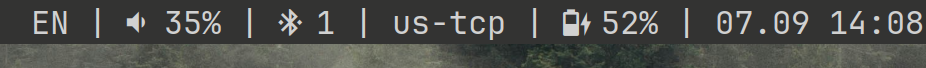

# sigbar
Minimal text-based status bar inspired by [someblocks](https://sr.ht/~raphi/someblocks/)  

All modules are run by the bar itself as daemons  
Different interpreters are supported  
The modules are triggered by real-time signals  

# installation
```sh
git clone https://github.com/zhmlst/sigbar.git
cd sigbar
sudo make install
```
